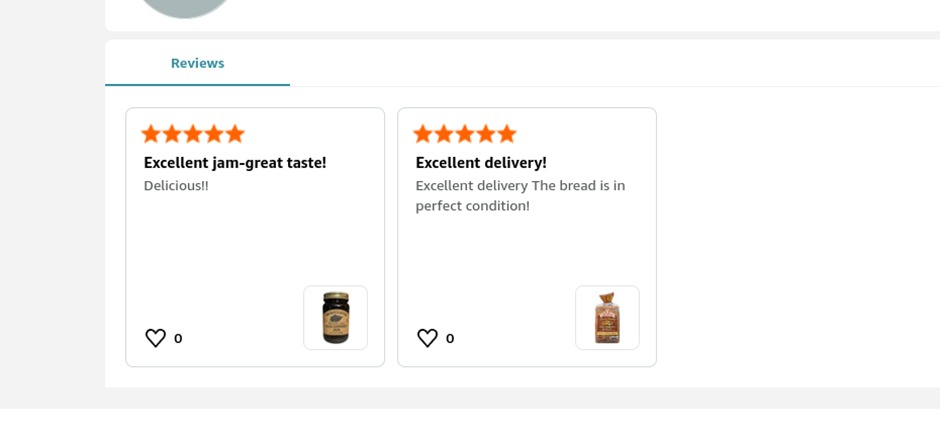
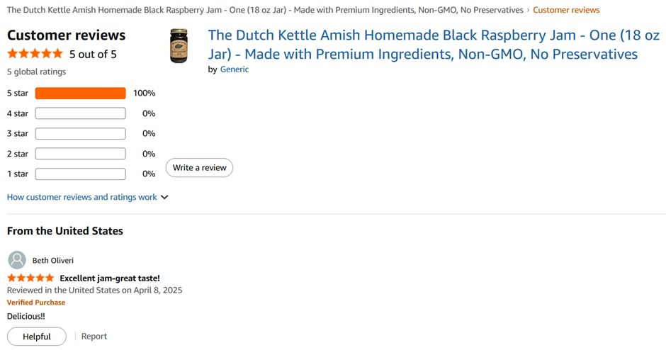

**Nice Jam (OSINT)**

Challenge: Nice Jam

Category: OSINT

Difficulty: Easy                                                                                      

Objective: Identify the jam’s flavour and person who placed this order.

File Provided: Image of a review.
 
________________________________________
**Approach**

The challenge provided an image of a jam jar and the hint:
“I saw this review online and ordered the same jam.”
This suggested a two-step OSINT workflow:
1.	Identify the product
2.	Trace its online review footprint
________________________________________
*Step 1 — Product Identification*

I started with reverse image search using Google Lens. Instead of uploading the full image blindly, I cropped the jar to focus on the label and branding. This improved search accuracy.
Google Lens quickly identified the product as:
The Dutch Kettle Amish Homemade Style Jam
From the label and search results, the flavor showed Black Raspberry.
________________________________________
*Step 2 — Finding the Review*

Since the challenge referenced an online order and review, I pivoted to major e-commerce platforms. A targeted search:
The Dutch Kettle Amish Homemade Style Jam Amazon
led to the product listing on Amazon.
 
I browsed the customer reviews and matched the wording of the challenge hint to a review by:
Beth Oliveri
This provided the second required component.
Below are the query results:-

________________________________________
**Flag**

CodefestCTF{Black_Raspberry_Beth_Oliveri}
________________________________________
**Lessons Learned**

•	Crop intelligently for reverse image search. Focusing on logos or labels can dramatically improve results.

•	Don’t overthink the question. I initially misinterpreted “person who made the order” as the manufacturer instead of the reviewer, which wasted time.

•	When image search hits a dead end, pivot to keyword search.

•	E-commerce platforms are prime OSINT sources for product-based challenges.

•	Small visual details can contain the entire solution if interpreted correctly.

